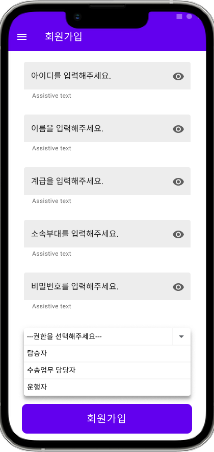
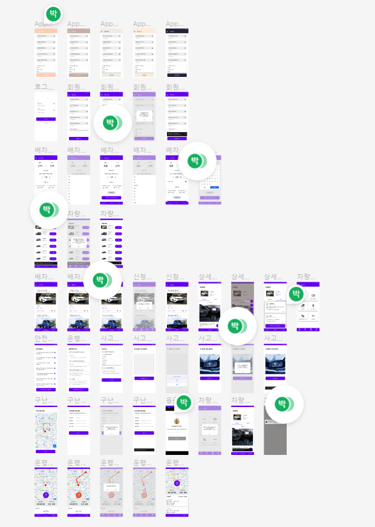

# Military Mobility Platform (군 모빌리티 플랫폼)
<br>
<div align="center">
    
</div>
<center><h3>군 모빌리티 플랫폼 : Military Mobility Platform</h3></center>

><center><h3>언제 어디서나 실시간으로 군 이동수단을 공유하는 플랫폼</h3></center>

# 목차
1. [프로젝트 소개](#프로젝트-소개)
2. [기능 설명](#기능-설명)
3. [App 구성 및 필수 조건 안내](#app-구성-및-필수-조건-안내)
4. [기술 스택](#기술-스택)
5. [설치 안내](#설치-안내)
6. [프로젝트 관리 및 개발 문서](#프로젝트-관리-및-개발-문서)
7. [팀 정보](#팀-정보)
8. [저작권 및 사용권 정보](#저작권-및-사용권-정보)

## 프로젝트 소개
### 개요
군 이동수단에 대한 배차 신청, 구난차량 요청 등 다양한 정보를 스마트폰 app을 통해 실시간으로 공유하고 관리할 수 있는 플랫폼을 구현하기 위한 프로젝트입니다. 군 이동수단의 특성 상 실시간으로 정보를 주고받아 신속하게 대응하는 것이 필요합니다.

또한 야전 현장에서는 운행 마일리지, 기록부 등을 수기로 작성하고 관리하는 방식으로 진행되고 있어서 운전병들은 자신의 운행 기록을 쉽게 조회할 수 없어 불편한 점이 있습니다.

이에 대한 문제점들을 해결하기 위해 수송업무 담당자(간부,군무원) 및 이동수단(차량) 탑승자, 운행자(직접운전 간부, 운전병)들이 모여 소통하고 군의 이동수단을 효율적으로 이용할 수 있도록 돕는 군 모빌리티 플랫폼을 고안했습니다.

군 모빌리티 플랫폼 app의 핵심 기능은 실시간 배차신청 및 확인, 안전점검 체크리스트 확인, 운행계획 작성, 사고접수 및 구난 요청, 운전병 마일리지 전산화 등 입니다.

### 기대 효과
-스마트폰 app을 통해 언제 어디서나 쉽고 간편하게 군 이동수단(차량) 관련 정보를 주고받을 수 있습니다.<br>
-운전병은 기존의 수기로 작성되던 운전병 마일리지, 운행기록부를 전산화하여 쉽게 조회/관리할 수 있습니다.<br>
-사용자(탑승자)는 사고 발생 시 신속하게 보고하고 구난차량을 요청할 수 있습니다.<br>
-수송업무 담당자는 자신이 관리하는 이동수단(차량)의 배차를 승인하고 목록을 조회하고 관리할 수 있습니다.<br>

### 발표 자료(추가 예정)

### 시연 영상(추가 예정)

[(Back to top)](#목차)

## 기능 설명

 ### 0. 로그인 / 회원가입
 #### 0-1. 로그인  
<table>
  <tr>
    <td align="center" width="50%"></td>
    <td>o 기능명: 로그인<br><br>
     	o 개요: 사용자 인증을 위한 로그인 화면입니다. 아이디와 비밀번호를 입력하고 허가된 사용자만 app에 접속할 수 있습니다. <br><br>
	o 엑터명: 탑승자, 수송업무 담당자, 운전자<br><br>
	o 사전 조건: 회원 가입이 되어있어야 함.<br>
	o 사후 조건: -<br><br>
	o 기능 흐름:<br>
	   1. 사용자는 아이디를 입력합니다.<br>
	   2. 사용자는 비밀번호를 입력합니다.<br>
	   3. 로그인 버튼을 클릭하면 서버에서 사용자 인증을 진행합니다.<br>
	   4. 인증이 성공하면 메인 화면 페이지로 이동합니다.</td>
  </tr>
</table>
<br>

 #### 0-2. 회원가입(추가 예정)
 <table>
  <tr>
    <td align="center" width="50%"></td>
    <td>o 기능명: 회원가입<br><br>
     	o 개요: 사용자 신청을 위한 회원가입 화면입니다. 아이디, 이름, 계급, 소속부대, 비밀번호, 권한을 등록합니다.<br><br>
	o 엑터명: 탑승자, 수송업무 담당자, 운전자<br><br>
	o 사전 조건: 현역 간부, 군무원, 용사 신분에 해당하여야 함.<br>
	o 사후 조건: -<br><br>
	o 기능 흐름:<br>
	    1. 사용자는 아이디를 입력합니다.<br>
	    2. 사용자는 이름을 입력합니다.<br>
	    3. 사용자는 계급을 입력합니다.<br>
	    4. 사용자는 소속부대를 입력합니다.<br>
	    5. 사용자는 비밀번호를 입력합니다.<br>
	    6. 사용자는 권한을 선택합니다.<br>
	    7. 회원가입 버튼을 눌러 가입을 요청합니다.</td>
  </tr>
</table>
<br>

 ### 1. 실시간 군 이동수단 배차 신청 / 확인
 #### 1-1. 배차 신청 
<table>
  <tr>
    <td align="center" width="50%"></td>
    <td>o 기능명: 배차 신청<br><br>
     	o 개요: 군 이동수단(차량) 관련 실시간 배차신청 화면입니다. 출발지 목적지를 설정할 수 있으며, 탑승인원 그리고 경유지 등 세부사항을 설정할 수 있습니다. 군 이동수단의 효율적인 이용을 위해 세부 옵션을 같이 신청받아서 유동적으로 활용할 수 있습니다. 행선지가 같거나 시간을 분배해서 차량을 사용할 수 있다면 효율적으로 이용할 수 있습니다.<br><br>
	o 엑터명: 탑승자<br><br>
	o 사전 조건: 회원 가입이 되어있어야 함.<br>
	o 사후 조건: -<br><br>
	o 기능 흐름:<br>
	   1. 사용자는 출발지와 도착지를 설정합니다.<br>
	   2. 탑승인원 탭에서 운전자, 선탑자, 탑승자 인원수를 설정합니다.<br>
	   3. 상세 옵션에서 경유지 여부, 차량 공유 여부를 설정합니다.<br>
	   4. 배차 가능 차량 검색 버튼을 통해 실시간으로 예약/즉시 사용 가능한 차량을 검색합니다.</td>
  </tr>
</table>
<br>

 #### 1-2. 차량 선택 
<table>
  <tr>
    <td align="center" width="50%"></td>
    <td>o 기능명: 차량 선택<br><br>
     	o 개요: 1-1. 배차 신청 화면에서 설정한 출발지 및 도착지, 탑승인원, 경유지 등에 따라 선택할 수 있는 차량 목록이 리스트 형태로 도시됩니다. 차량의 외관 사진, 차량 번호, 색상 등에 대한 정보를 볼 수 있으며, 선택하기 버튼을 누르면 실시간으로 배차 신청을 할 수 있습니다.<br><br>
	o 엑터명: 탑승자<br><br>
	o 사전 조건: 배차 신청의 기본 정보가 입력되어야 함.<br>
	o 사후 조건: -<br><br>
	o 기능 흐름:<br>
	   1. 사용자는 선택 가능한 군 이동수단 목록을 확인합니다. <br>
	   2. 사용자가 원하는 차량의 정보를 확인한 후 선택하기 버튼을 클릭합니다.<br>
	   3. 1-3. 배차 확인 화면에서 선택한 차량의 배차 진행 현황을 확인할 수 있습니다.</td>
  </tr>
</table>
<br>

 #### 1-3. 배차 확인
<table>
  <tr>
    <td align="center" width="50%"></td>
    <td>o 기능명: 배차 확인<br><br>
     	o 개요: 배차 확인 화면에서는 탑승자가 신청한 희망 차량에 대한 예약 진행 현황을 확인할 수 있습니다. 상태는 '예약진행중', '예약불가', '예약확정'으로 나뉘며, 탑승자는 배차 취소 및 해당 차량 상세보기를 할 수 있습니다.<br><br>
	o 엑터명: 탑승자<br><br>
	o 사전 조건: 배차 신청 및 차량 선택이 완료되어야함.<br>
	o 사후 조건: -<br><br>
	o 기능 흐름:<br>
	   1. 사용자는 본인이 배차 신청한 내역을 확인할 수 있습니다. <br>
	   2. 신청한 이동수단에 대한 외관 사진, 차량번호, 특이사항 등을 확인할 수 있습니다.<br>
	   3. 사용자는 '취소하기' 버튼을 클릭하여 배차 신청을 취소할 수 있습니다.<br>
	   4. 사용자는 '상세보기' 버튼을 클릭하여 차량 정보를 확인할 수 있습니다.<br></td>
  </tr>
</table>
<br>

 ### 2. 군 이동수단의 one-stop 관리 서비스
 
<table>
  <tr>
    <td align="center" width="50%"></td>
    <td>o 기능명: 군 이동수단의 입체적인 관리<br><br>
	o 개요: 군 이동수단의 관리 화면입니다. 안전 점검표를 차량 운행 전에 작성하고, 운행계획을 작성할 수 있습니다. 또한 사고접수, 구난차량 요청, 응급환자 후송 요청 등 응급상황에 대처할 수 있는 기능들을 포함하고 있습니다. 또한 차량 이용 완료 후에는 반납까지 one-stop으로 서비스를 받을 수 있습니다.<br><br>
	o 엑터명: 탑승자<br><br>
	o 사전 조건: 배차 신청 및 승인이 완료되어야 함.<br>
	o 사후 조건: -<br><br>
	o 기능 흐름:<br>
	   1. 사용자는 안전점검표 작성을 통해 차량의 안전 운행을 준비합니다.<br>
	   2. 운행 계획에 출발지, 도착지, 이동 경로, 특이사항 등을 기재합니다.<br>
	   3. 차량 사고 발생 시 사고접수, 구난차량 요청, 응급환자 후송 요청 등을 실시합니다.<br>
	   4. 차량 이용 완료 후 차량 반납 탭을 클릭해 차량 이용을 종료합니다.</td>
  </tr>
</table>

 ### 3. 운전병 마일리지 전산화

[(Back to top)](#목차)

## App 구성 및 필수 조건 안내
* 크로스 플랫폼: iOS, Android 사용 가능
* 권장: 

[(Back to top)](#목차)

## 기술 스택
### 📲 Front-end

| Name     | Badge                                                                                                           | Version        | Website               |
| -------- | --------------------------------------------------------------------------------------------------------------- | -------------  | --------------------- |
| Dart     |           | undefined      | https://dart.dev/     |
| Flutter  |  | undefined      | https://flutter.dev/  |

### 🖥️ Back-end

| Name       | Badge                                                                                                          | Version    | Website                  |
| ---------- | -------------------------------------------------------------------------------------------------------------- | ---------- | ------------------------ |
| Python     |          | undefined  | https://www.python.org/  |
| DjangoREST |  | undefined | https://www.django-rest-framework.org/ |
 
### 💾 Databases

| Name     | Badge                                                                                                     | Version           | Website               |
| -------- | --------------------------------------------------------------------------------------------------------- | ----------------- | --------------------- |
| MariaDB  |   | undefined         | https://mariadb.org/  |

[(Back to top)](#목차)

## 설치 안내
```bash
$ git clone git주소
$ yarn or npm install
$ yarn start or npm run start
```

[(Back to top)](#목차)

## 프로젝트 관리 및 개발 문서
 - [Figma 프로젝트 화면설계서 링크](https://www.figma.com/file/UTHVGHLnpkpmhcldx03Cjj/Military-Mobility-Platform?node-id=0%3A1)
<div align="center">
    
</div>

 - [Database 설계 Diagram 링크](https://viewer.diagrams.net/?tags=%7B%7D&highlight=0000ff&edit=_blank&layers=1&nav=1&title=mmp_db.drawio#R7Z1bd5u4Fsc%2FDWt1HpIF2GB4BDuZtpO0M2naaefFixiScGobF3CT9NMfiZsB7bjC5makWV3nGExkW%2FpLP7TZF2E0XT3%2F6Vubx2vPdpaCLNrPwmgmyPJYk2UB%2FxPtl%2FiMpKnJmQfftZNzuxOf3F9OclJMzm5d2wkKF4aetwzdTfHkwluvnUVYOGf5vvdUvOzeWxY%2FdWM9OMSJTwtrSZ7917XDx%2Fispoi7828d9%2BEx%2FWRJTN5ZWenFyYng0bK9p9yp0YUwmvqeF8avVs9TZ4l7L%2B2X%2BO8uX3k3%2B2K%2Bsw5p%2FmD57j%2Fv7OKt9eNiu7n9dvbz1v71%2Fixp5ae13CY%2FWJjKgpF%2B5fAl7YfgyV0trTU6MskPTltx%2FNB5zp1KvsifjrdyQv8FXZK8e6aNko9IdHE2HivxiaddL8viJLnqMd%2FFYy251ErG9iFrf%2Ffz0YukB%2BDeeBf8%2B7z959edbMqWbU6f5HdnZ2cTojc%2BB45P9sWjtcEvQ%2BsOnzKD0PLDRLrod41MJMbQctfoT0czKTpeLq1N4EaXx2ce3aV9Zb142zBtKD0y791nx76JlYuvRSK%2BQo3hQ9z4PWr8U%2FJl8NvW0n1Yo9cLNBz4E03fCdB3ubKCMGtgu7YdO%2Fl7cvj2KoN6THVJKQypBI3oGBjQUTrXax9PjVT33rG8wfPTfPR89xcewWXSY%2FnxjY6TufDWsezSKdOLVrponNzlcuotPSyCtRfNnKIO8EW2721uLf%2FBCZMTG89dh1E%2FKCb6h3pmKp4rgoK%2B6xQdS7tj9A9f7odTbx2EPtIbbsNBw%2F7k4KE3Q2%2BTNLp07tP2%2FaTf8es7Lwy9FaVI9k6Y34skEUU67X%2BriaYkoROS%2BPuvV0WBfn%2FoWssbBBZr%2FbCMhzDijLUbQmCcwZ7Pers8DOUJ7aHuvF9GqHh0bdtZHzo6GvXo5IZjVHE0ksZ2fVS5NWuJ1q21FaLJg35kQAxx9j0PH%2FV0hSmt7PN36JX4xvh8%2B3H%2B7sP05uL64sPtHx3LIV3P42vNYGMt3PXDVfyXakkvSjd6eX59Nku16oequTYEBNwocZQAKBFbQ4naNUokmV4T7Swdju2m7dUKEon%2BZnDwJBkRg762Vk66axLfCBdTQZ8J5li4MAVDFbRx74HShU7YI8iYE6RnBNE7J4jCDEHG1IMzeIKoxKA%2FOKhH%2FSJDtLGAJhhiiDliiyH0SmGPIaSBkjOkW4ZIcucQqWDlPHGI0I%2FO4CFC2jF9a%2F09jxAjJkf0QhM0nSGE0OuEOYSkyxVHSH8QonSNELmCdfO0EZLJnyMkHePcoNsOHt0V7sLiXkQVtGn6YsYOSCqoZcgg%2Bd9b68u%2FP95%2F%2FSb9c7fa3M5m85cp5DnCOdItR7QWOQJqYogPRPaKnymKgD1BPg4ZIh2OFMGQ4WBsZ9906%2FnpauSNPe%2FrRpxc3nE49A4OmTLagAOoiSHCYa%2F4mYID2BNswOFIEQwZDvCuqoIsOB3aocO4RTrAoqjgHnEyeNgvf6b4AHdF7%2FwfWrQt0cuAPUKQLhKcEB0TYtI5ISo4P5w4IVTq0Rk8IXrn3NAiIehlMGRCXK2n1%2FqP2%2B2Pf6zrt1%2F%2BU1ajxV%2BAgWlq%2BfsZUeJBHwM1SWHUE5qpjIqhmYoKhGYqCjCydYRmggNYwRrENOFhWeydE0cFY4IqaEoEpCHgJIIxKcdDph6PAVEc7Alyb49W6yT4MnJxVgVNxC%2B0afLClAVNEy5mgq5h7zX8IN7E%2F3sxFdDEMzR8jX4paHp0snx97z0UaEI4a1fZnpsEueKs%2F81NAk1zLciugnWBacbA96T1MAaK0myVMRVMCb3ZNVIOhkI9GEMHDGkaWG9Xd%2BWQmhI56sSG1NnWcuX9zH2HaEuRP%2FZCK%2F8dbWfp5I9LYqxdeMwxh6ec6Z45UFxnq8whgzMGwxwmc8rAsiQjKVZR%2Fru9zImCccxoI2Mg%2BCicObULb8jMgQ3FFdYbDp2GoAMGgjZFHVAGI3JBOkXs7Jc4U9yBh5l89oE2O3Pvfr6xgsBZPzh%2BkGfQTNBGgi5F4TuIPrHFzMAMSmxuhmAoiW0NJ67RohcIWCJnU%2F3qHDKc4IWU%2B4L3AE5QiGmrW6KTTJZGOxxMenzDXUE%2B0tug2bVdBq63nocvm1KmNFMV9HG0GZpEuQoiS5yuRLBCCJr98Vo6auZBdKwS2QMRT8DWAxBBMartgqh3Psc1gojJLGtwV5DP%2FRbRIBUTG4wio1z8QuL7nfp1xh5meI627jEDRru2i5neOS7XiBkm87DBXUGa3pfewgrRbqeUEjrK6Il3PDra4nDS1C%2B1IZMGtDry%2FUwPQAMFzrb61GcY25m9AmcKM2BPkJuZtePY86W7cNaBU3zaoysJaXQD29Zi%2F2hDjyoSoHcngsbxU78Ch0wf2ZQe3r%2BVz5406aO4uDWvf9xfnsnjChZ9zp%2Bm%2BAOF5TbFn1d00LssLwcR6DciZ4pBr%2FQFecO5sNZz37VLD3U0DT%2FFidOFGhLgbMA9DSiAdLQgh4yk6dV%2Ff1%2BpS%2F3LzdXtzP37x%2BP3MxtyNZj57k9ewZVSKZKsU8QJQ0kfsiLHx%2BAFHlN%2Bl0F3l0Ejk%2F2zppdFXOGvfKKBw4eND5O3IHBXkHcg8QLPbiHXYyUz5MwhcN%2FwqGD6bWtLQGmzlCv8lU8xSviwwWEyaBjuCiBqmMVSrsfqhDmEVCmXwxHSDkLarOUKi6LCRvW0ESLTD87QEQKksmayDN%2BxOmEPIdx5o3cIabWUK6yKU3TmOGxtYNK3A%2B4Kcu%2FJcB2%2BY9UyZJLAT3n4ZqR%2FJGmzoiusiiHuRvbrnymSwF1B7kau3aVjPZRtWkbqDKjuMqjiAFwttXhNE4uXMU1jc49x0egvbY5V1JBpA5dW57DpHWzaLPsKpz8ZIGv2qp8p1MBJiIghB3zRa3Q77y9CjhTKkAkC7%2BXIp25v3SD0knVoGF56%2BKhW91DS55X2ZqaqEvVyrRAF8AEUIR9ApQa%2BwJLhSXUbvuuQK9cDgxYsSBXN2UrJyFvsAzi9%2FEvqGDONeQLKByXfVWvFCE1rLVAEyHX5OUj8APt9j9GY018FdTwXxzI3vFLVjcN%2BtVA114Zc%2BL6VjiAHe5FXJwjk9NcqQUbkvjUhSNf718YIMjpoBztMgpBb2LQoFaMAqSAO9gDC%2FTV6twWBXP7aBQgz7hqjg9w1hskNencNnNw2epKG5p4%2B8Cdpx8qGPaLwPIG9IwroAdguUk4xbeBha8NBSQSHiRTSlGn5vosOi0%2FTtMs0h6CIn6wxyJPK2QDZ4UmVNDycJy3xBPIDbJUnQM6egfIk0z%2FnyZjcl9roA0MXCm6dprU2puxwpIJW2ONIhVB4zpGWOAK5%2BLXLkQq71RPniEo9OoPnCLkZJRmSxSTF6WZTmKRZ%2FxhKmVBBOexRhZeo7R1VwCIZrVIl3R4xQJWD6tcOkioK6Yvjo2%2FrlJImSFGV9CQKiSGIVC4lyxBEKJYLx35wUu8I1NNu%2BHLjLKN6LBe7d2Ifipgikow5E66WyZR31rbh%2B9FIXtz8cnzv1ru21i8pe3bvray1%2FTHSUnGg0af6L1%2FzB9%2FwwbmSHs6e82%2FOXrIjO%2F1KZdJFJ5xnN%2Fyafkn0OtcqOto1ig9eXhXdPifxwNv6i6QfwfTkSXeHKSVfG6jUkwQPBu1aJ0HkyU760SD%2BzLe2V8l%2FY3bv5shkUnRqV9NEt2kT8U9P%2FmqnXKIhrdSQUm4o7huiodqmgNz2FEDL5WszoDA7ipOAVG9R3YcLc6%2Fva28EJ0mlVMoTSTxMcURSZrXcUn2SA8cAUFy8t4t9GzRF0KPa8YjdGuqnGNqGYGjRu3Ga9zi8GL%2F7Bt0iL5xNuLXwB8%2Bs0EL%2Fd%2B3ZzhIBFcB8cjMPSqayvxq6SU4tKUlnno2AR77SRJQAaUh1JLkGu5h8dJPmLQcDtvGZCzBrfnESPj26ofMJ3avgd598a1Oc5pRzUK7ay%2Bq42McK4KiV9WW%2Bh9Wm%2Bpc0aX5xHt1FdJ8T1czB5T%2B1SLuop2V02NOu1ZW%2Bde2eaL5Xkw1EmdCSu3spKvLdy87WxGJnjzrvbCBrGI56ybp6gldj3KvTJGmpZuZe9H7hGMu963DySVq%2Bw7EfRkQ3%2FTLVdpYxNlK%2B0fs%2BL4scetTQcp8DD6BiH0ozvc9Ad0RxoTNdS8RtjMnuffRWd9vg912buxPWm%2BzpUXntJgNrFaCj6wirhX8BxTOd3FYgMZzkOq4o4FI3HrwNbm6bm%2F683G5i3%2B1Yfpu7V6lVdh37RvjIPYcyKQmsPEVptxxqaR1WWt5x0ETrDVGYPdGRVtojqZJ%2Brir67r%2FDVFW%2Bd%2F1Ns69oDA269ZK7LHlI8%2BqP0WXgU1Ux%2B08qCThuv145A555yV2BFD0vHWNr9%2BkBTS3ZwsZALcJWgUYTpFXHurFbKr6l6wHFurFbK77ll4o%2BAS1Vak8Woole4pB4INC0kkViXJZg00CjCBQ7QpgHCOxQCNYtTFplTrgwj6HgpLTLS3fazXIP2sgNgHt6afS7515LG7m%2Bca8nq4EkSuNzVS%2BuCLp4Lub%2Bkw9bH8Cm5b1NN40yigC1jlAmdYsy9TRRJpUWM60W4Wqidp7GnmTMUc8VOrFWxRuaJqWtSBt8g9xRhsA3rZQBEEq00Crfxi3Zg6rx7SRZpanF6Z49Yqk8wRX9XB2V7ShZs%2BN2N1gKhXsxVwitQs4ldWeV0%2BC14BC9lJpqWSMquVxPH53F9ys3wN%2FzTfpsKXMCEKO1WwIj4yo9u2tp3Z6UXY6AHJ2NPcqTTenh%2FVv57EmTPoqLW%2FP6x%2F3lmQREIt44geP%2FjNzRiF49tYS%2F5EhWd0kalbfmQMzwCHJVG1d06M18oMouUMAT3%2FZdxV%2FRDw9GpAsbgdX4m0l5TLJfWJLNLSSkiQPnanxFCv3J0kg9JgdFHULFAPaNAbAqVGytlUlPmhhy0Ji79hvj8%2B3H%2BbsP05uL64sPt70PDqHJ2NiAUPaUFpjUKhyq5lpRDo8ypI8ybA4XgD0cxEUdcYXwdz7JwELqATkolvDUy9C8MtCkaejO877nfGK1tKyZIpjobTGJUDeiF2ibZ8z2uGhSa0RqBSSQamotM9KABCtS6IgCNzTNtaJJmdAkp1D7FMpCuTrEUIWcbCeHoUzmHEOSQnqeLSy%2FlA24GCyAXdrliE0zDCnzmOpojNGngvIYpE%2BFpOScPs3Rh9Zm1iB9KhhPT48%2B9CMyfPqQxlE7jh%2BGyj7Hkdrj3K4nuYrTp27lMUgfXqqxF%2FQBkgK1TZ8KttjTo89BlRiHSR%2FAryIuiLL1nabrobCGnsolHhlCj8prPPYCPYC3aMvoUSsYYE8OPSq9i9Hw0UPaV200G9x17F7WcPEUxuBTQXgMwofXh%2BwDfGQgm1vb8DnFopDUa8BBdSAHCh%2FSvHqPJp335PjBfL1dkXufcZoUH5%2BN%2FBC0KDAoSqJvSGnyqNhdweQOCc0Ik0E48VKTvYATrWd%2Fg3A6xfKS1GvAQRUlBwon0voaoIHxsqSyUYiTGfu%2BTRNvOL4hqsacytUoGWJO%2Bj04c7plDhDc1TJzJhXssifHnEzmnDnShDS7usEcDa2PFvBSdZcie5LEuROcuBg%2FHlI5h5rRIIMc4mWR%2B8ChEVBrrG0OnWIpZOo14KDqxwPlEGmB9XPxo7gUcskxDooRymoj89CgajSqXFuZJRrxfAa9oNG4exqdYkFl6jWgtmwGA6ARaXJFuyJrs%2FFRD9ulWspGWqUlegzEt0VHgaixTAlDABHPlNALEHWfKiE1EA4TRDxVwm6ggbrLaEoU%2FeQQg%2BQIN4lpjuOmAamxhxuNNA1z3LSPm3H3KRG0IadEyGTOcSNpQEoExJvQsedWWELOCG94sozZWY4eHCMUO8yNOYca0CCDHOLJEY7h0AEFt0vJZpXu0yJoQ06LoPG0CLu%2B4G6vHU%2F27qPQtSE7vGrc4XXXF6RB84MXuvfugqeaT%2BuWFWfnmHZ2ZtN6wInm077hrKgx0bxGbxLrTaJ5nbSSDirRfCZ0nmhe0kmrJNvJ5SuIg73k8jr3JK3fhl0dEd0%2FMdWH7Eiqc0fSXV%2BQ1sJt4PjzwFnbuQzziqBF%2FjmGij1GE%2Bt1GtCdpZrnbqSV7h0r6JA9M7bO3Uj7gKIeZJjXh%2BxGqnM30l1fkIbMOytEUxmHNPjOwink%2B41fvCnmGIlJFGdfNKOUWAbOSSJHJxHCtN0LzqkGNMogp7iXaS841flDVzn9tGFyinuZ7gaatJ9uHH%2FlBkH0FGbflqkIKjmuw6xGV87wn%2BA6zDxVfSU4cZ%2FUPUolrb8cTh3AqXMnAVkcsE%2FqTuYcTrJIWm5XThBYD84eMpk4JCIunKIbgqHzvVED0mMQP9wVtRf46TxdvSwO2CF1J3OOH1kkjbVo9obbQEhy1Bt6lCQ4C35IUjKmG6SRoEl4L4TjJaYcQw1IkEEM8YJdfcBQ94nrZXHABbt2MucYktNUbHB%2BrJRFaFqZ4q5ucZKLBMqUZYj4EP%2FJCO2TOJca0CR7XJJ4Na9ecKnznPWyVMFOe3JcymTOuSRLpBk2fNk4c%2B9%2Bvi6E8ux5iGTIghaxyFAQrDiLGtAhgywahsPvIQGdydY5oYEK0mCQaxG3zh5z%2B1GD1LrfEEtDtstKLNhl0aHveWH%2Bct%2FaPF57iJro5P8B)
 - [backend swagger 링크](http://20.214.203.20:8000/swagger)

[(Back to top)](#목차)

## 팀 정보
<table width="800">
<thead>
<tr>
<th width="100" align="center">이름</th>
<th width="250" align="center">역할</th>
<th width="150" align="center">Github 계정</th>
<th width="300" align="center">E-mail</th>
</tr> 
</thead>

<tbody>
<tr>
<td width="100" align="center">박유진</td>
<td width="250" align="center">팀장(PM), UI/UX 디자인</td>
<td width="150" align="center">	
	<a href="https://github.com/LatteHorse" target="_blank"></a>
</td>
<td width="300" align="center">
	<a href="mailto:eugene5802@gmail.com">eugene5802@gmail.com</a>
</td>
</tr>
	
<tr>
<td width="100" align="center">박철완</td>
<td width="250" align="center">프론트엔드(Front-end) 개발</td>
<td width="150" align="center">	
	<a href="https://github.com/CodingVillain" target="_blank"></a>
</td>
<td width="300" align="center">
	<a href="mailto:cheolwan.park552@gmail.com">cheolwan.park552@gmail.com</a>
</td>
</tr>

<tr>
<td width="100" align="center">이승효</td>
<td width="250" align="center">프론트엔드(Front-end) 개발</td>
<td width="150" align="center">	
	<a href="https://github.com/AstroHyo" target="_blank"></a>
</td>
<td width="300" align="center">
	<a href="mailto:spinelee2002@gmail.com">spinelee2002@gmail.com</a>
</td>
</tr>
	
<tr>
<td width="100" align="center">박세환</td>
<td width="250" align="center">백엔드(Back-end) 개발</td>
<td width="150" align="center">	
	<a href="https://github.com/sehwan505" target="_blank"></a>
</td>
<td width="300" align="center">
	<a href="mailto:sehwan505@gmail.com">sehwan505@gmail.com</a>
</td>
</tr>

<tr>
<td width="100" align="center">박주환</td>
<td width="250" align="center">백엔드(Back-end) 개발</td>
<td width="150" align="center">	
	<a href="https://github.com/Jkworldchampion" target="_blank"></a>
</td>
<td width="300" align="center">
	<a href="mailto:standardjuhwan@gmail.com">standardjuhwan@gmail.com</a>
</td>
</tr>
</tbody>
</table>

[(Back to top)](#목차)

## 저작권 및 사용권 정보
 * [MIT](https://github.com/osamhack2022/APP_Military-Mobility-Platform_TeamName/blob/main/LICENSE)

This project is licensed under the terms of the MIT license.

※ [라이선스 비교표(클릭)](https://olis.or.kr/license/compareGuide.do)

※ [Github 내 라이선스 키워드(클릭)](https://docs.github.com/en/github/creating-cloning-and-archiving-repositories/creating-a-repository-on-github/licensing-a-repository)

※ [\[참조\] Github license의 종류와 나에게 맞는 라이선스 선택하기(클릭)](https://flyingsquirrel.medium.com/github-license%EC%9D%98-%EC%A2%85%EB%A5%98%EC%99%80-%EB%82%98%EC%97%90%EA%B2%8C-%EB%A7%9E%EB%8A%94-%EB%9D%BC%EC%9D%B4%EC%84%A0%EC%8A%A4-%EC%84%A0%ED%83%9D%ED%95%98%EA%B8%B0-ae29925e8ff4)

[(Back to top)](#목차)
