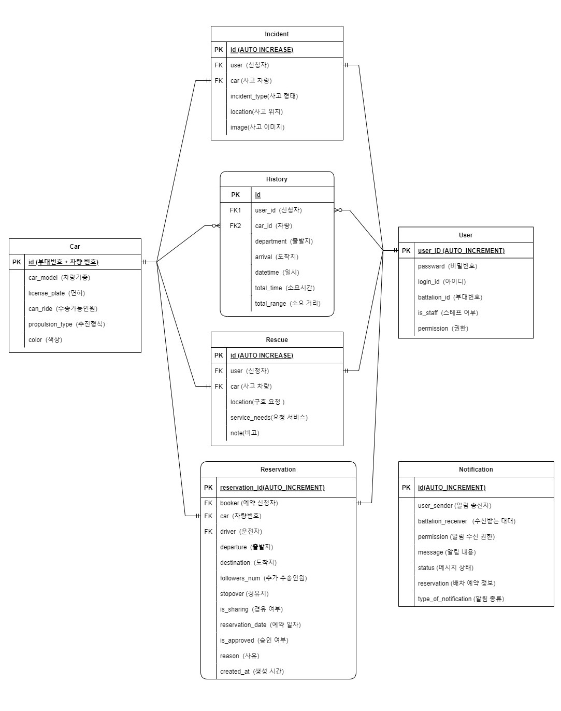
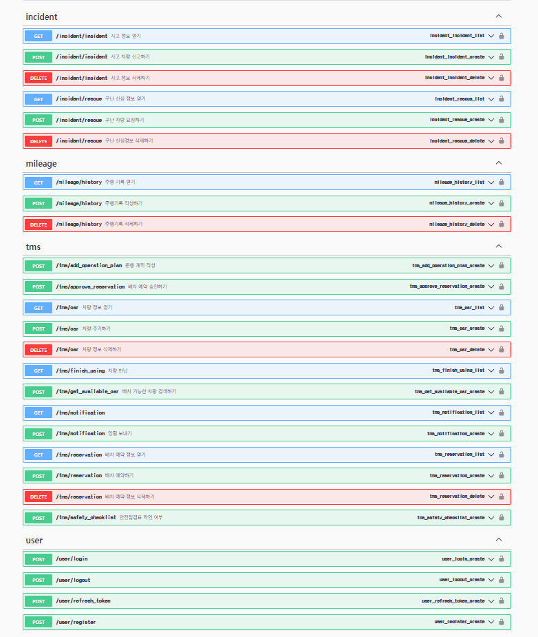

# Military Mobility Platform (군 모빌리티 플랫폼)
<br>
<div align="center">
    
</div>
<center><h3>군 모빌리티 플랫폼 : Military Mobility Platform</h3></center>

><center><h3>언제 어디서나 실시간으로 군 이동수단을 공유하는 플랫폼</h3></center>

# 목차
1. [프로젝트 소개](#프로젝트-소개)
2. [기능 설명](#기능-설명)
3. [App 구성 및 필수 조건 안내](#app-구성-및-필수-조건-안내)
4. [기술 스택](#기술-스택)
5. [설치 안내](#설치-안내)
6. [프로젝트 관리 및 개발 문서](#프로젝트-관리-및-개발-문서)
7. [팀 정보](#팀-정보)
8. [저작권 및 사용권 정보](#저작권-및-사용권-정보)

## 프로젝트 소개
### 개요
군 이동수단에 대한 배차 신청, 구난차량 요청 등 다양한 정보를 스마트폰 app을 통해 실시간으로 공유하고 관리할 수 있는 플랫폼을 구현하기 위한 프로젝트입니다. 군 이동수단의 특성 상 실시간으로 정보를 주고받아 신속하게 대응하는 것이 필요합니다.

또한 야전 현장에서는 운행 마일리지, 기록부 등을 수기로 작성하고 관리하는 방식으로 진행되고 있어서 운전병들은 자신의 운행 기록을 쉽게 조회할 수 없어 불편한 점이 있습니다.

이에 대한 문제점들을 해결하기 위해 수송업무 담당자(간부,군무원) 및 이동수단(차량) 탑승자, 운행자(직접운전 간부, 운전병)들이 모여 소통하고 군의 이동수단을 효율적으로 이용할 수 있도록 돕는 군 모빌리티 플랫폼을 고안했습니다.

군 모빌리티 플랫폼 app의 핵심 기능은 실시간 배차신청 및 확인, 안전점검 체크리스트 확인, 운행계획 작성, 사고접수 및 구난 요청, 운전병 마일리지 전산화 등 입니다.

### 기대 효과
-스마트폰 app을 통해 언제 어디서나 쉽고 간편하게 군 이동수단(차량) 관련 정보를 주고받을 수 있습니다.<br>
-운전병은 기존의 수기로 작성되던 운전병 마일리지, 운행기록부를 전산화하여 쉽게 조회/관리할 수 있습니다.<br>
-사용자(탑승자)는 사고 발생 시 신속하게 보고하고 구난차량을 요청할 수 있습니다.<br>
-수송업무 담당자는 자신이 관리하는 이동수단(차량)의 배차를 승인하고 목록을 조회하고 관리할 수 있습니다.<br>

### 발표 자료(추가 예정)

<iframe src="https://docs.google.com/presentation/d/e/2PACX-1vQ43KBXZZqnEAMP_ddxZRnNsgHBSEi2qVnJPBkTqsEBGGmw-ERHwm6VLj499oOF5rKSbOB6h0kazxMD/embed?start=false&loop=false&delayms=3000" frameborder="0" width="960" height="569" allowfullscreen="true" mozallowfullscreen="true" webkitallowfullscreen="true"></iframe>

### 시연 영상(추가 예정)

[(Back to top)](#목차)

## 기능 설명

 ### 0. 로그인 / 회원가입
 #### 0-1. 로그인  
<table>
  <tr>
    <td align="center" width="50%"></td>
    <td>o 기능명: 로그인<br><br>
     	o 개요: 사용자 인증을 위한 로그인 화면입니다. 아이디와 비밀번호를 입력하고 허가된 사용자만 app에 접속할 수 있습니다. <br><br>
	o 엑터명: 탑승자, 수송업무 담당자, 운전자<br><br>
	o 사전 조건: 회원 가입이 되어있어야 함.<br>
	o 사후 조건: -<br><br>
	o 기능 흐름:<br>
	   1. 사용자는 아이디를 입력합니다.<br>
	   2. 사용자는 비밀번호를 입력합니다.<br>
	   3. 로그인 버튼을 클릭하면 서버에서 사용자 인증을 진행합니다.<br>
	   4. 인증이 성공하면 메인 화면 페이지로 이동합니다.</td>
  </tr>
</table>
<br>

 #### 0-2. 회원가입(추가 예정)
 <table>
  <tr>
    <td align="center" width="50%"></td>
    <td>o 기능명: 회원가입<br><br>
     	o 개요: 사용자 신청을 위한 회원가입 화면입니다. 아이디, 이름, 계급, 소속부대, 비밀번호, 권한을 등록합니다.<br><br>
	o 엑터명: 탑승자, 수송업무 담당자, 운전자<br><br>
	o 사전 조건: 현역 간부, 군무원, 용사 신분에 해당하여야 함.<br>
	o 사후 조건: -<br><br>
	o 기능 흐름:<br>
	    1. 사용자는 아이디를 입력합니다.<br>
	    2. 사용자는 이름을 입력합니다.<br>
	    3. 사용자는 계급을 입력합니다.<br>
	    4. 사용자는 소속부대를 입력합니다.<br>
	    5. 사용자는 비밀번호를 입력합니다.<br>
	    6. 사용자는 권한을 선택합니다.<br>
	    7. 회원가입 버튼을 눌러 가입을 요청합니다.</td>
  </tr>
</table>
<br>

 ### 1. 실시간 군 이동수단 배차 신청 / 확인
 #### 1-1. 배차 신청 
<table>
  <tr>
    <td align="center" width="50%"></td>
    <td>o 기능명: 배차 신청<br><br>
     	o 개요: 군 이동수단(차량) 관련 실시간 배차신청 화면입니다. 출발지 목적지를 설정할 수 있으며, 탑승인원 그리고 경유지 등 세부사항을 설정할 수 있습니다. 군 이동수단의 효율적인 이용을 위해 세부 옵션을 같이 신청받아서 유동적으로 활용할 수 있습니다. 행선지가 같거나 시간을 분배해서 차량을 사용할 수 있다면 효율적으로 이용할 수 있습니다.<br><br>
	o 엑터명: 탑승자<br><br>
	o 사전 조건: 회원 가입이 되어있어야 함.<br>
	o 사후 조건: -<br><br>
	o 기능 흐름:<br>
	   1. 사용자는 출발지와 도착지를 설정합니다.<br>
	   2. 탑승인원 탭에서 운전자, 선탑자, 탑승자 인원수를 설정합니다.<br>
	   3. 상세 옵션에서 경유지 여부, 차량 공유 여부를 설정합니다.<br>
	   4. 배차 가능 차량 검색 버튼을 통해 실시간으로 예약/즉시 사용 가능한 차량을 검색합니다.</td>
  </tr>
</table>
<br>

 #### 1-2. 차량 선택 
<table>
  <tr>
    <td align="center" width="50%"></td>
    <td>o 기능명: 차량 선택<br><br>
     	o 개요: 1-1. 배차 신청 화면에서 설정한 출발지 및 도착지, 탑승인원, 경유지 등에 따라 선택할 수 있는 차량 목록이 리스트 형태로 도시됩니다. 차량의 외관 사진, 차량 번호, 색상 등에 대한 정보를 볼 수 있으며, 선택하기 버튼을 누르면 실시간으로 배차 신청을 할 수 있습니다.<br><br>
	o 엑터명: 탑승자<br><br>
	o 사전 조건: 배차 신청의 기본 정보가 입력되어야 함.<br>
	o 사후 조건: -<br><br>
	o 기능 흐름:<br>
	   1. 사용자는 선택 가능한 군 이동수단 목록을 확인합니다. <br>
	   2. 사용자가 원하는 차량의 정보를 확인한 후 선택하기 버튼을 클릭합니다.<br>
	   3. 1-3. 배차 확인 화면에서 선택한 차량의 배차 진행 현황을 확인할 수 있습니다.</td>
  </tr>
</table>
<br>

 #### 1-3. 배차 확인
<table>
  <tr>
    <td align="center" width="50%"></td>
    <td>o 기능명: 배차 확인<br><br>
     	o 개요: 배차 확인 화면에서는 탑승자가 신청한 희망 차량에 대한 예약 진행 현황을 확인할 수 있습니다. 상태는 '예약진행중', '예약불가', '예약확정'으로 나뉘며, 탑승자는 배차 취소 및 해당 차량 상세보기를 할 수 있습니다.<br><br>
	o 엑터명: 탑승자<br><br>
	o 사전 조건: 배차 신청 및 차량 선택이 완료되어야함.<br>
	o 사후 조건: -<br><br>
	o 기능 흐름:<br>
	   1. 사용자는 본인이 배차 신청한 내역을 확인할 수 있습니다. <br>
	   2. 신청한 이동수단에 대한 외관 사진, 차량번호, 특이사항 등을 확인할 수 있습니다.<br>
	   3. 사용자는 '취소하기' 버튼을 클릭하여 배차 신청을 취소할 수 있습니다.<br>
	   4. 사용자는 '상세보기' 버튼을 클릭하여 차량 정보를 확인할 수 있습니다.<br></td>
  </tr>
</table>
<br>

 ### 2. 군 이동수단의 one-stop 관리 서비스
 
<table>
  <tr>
    <td align="center" width="50%"></td>
    <td>o 기능명: 군 이동수단의 입체적인 관리<br><br>
	o 개요: 군 이동수단의 관리 화면입니다. 안전 점검표를 차량 운행 전에 작성하고, 운행계획을 작성할 수 있습니다. 또한 사고접수, 구난차량 요청, 응급환자 후송 요청 등 응급상황에 대처할 수 있는 기능들을 포함하고 있습니다. 또한 차량 이용 완료 후에는 반납까지 one-stop으로 서비스를 받을 수 있습니다.<br><br>
	o 엑터명: 탑승자<br><br>
	o 사전 조건: 배차 신청 및 승인이 완료되어야 함.<br>
	o 사후 조건: -<br><br>
	o 기능 흐름:<br>
	   1. 사용자는 안전점검표 작성을 통해 차량의 안전 운행을 준비합니다.<br>
	   2. 운행 계획에 출발지, 도착지, 이동 경로, 특이사항 등을 기재합니다.<br>
	   3. 차량 사고 발생 시 사고접수, 구난차량 요청, 응급환자 후송 요청 등을 실시합니다.<br>
	   4. 차량 이용 완료 후 차량 반납 탭을 클릭해 차량 이용을 종료합니다.</td>
  </tr>
</table>

 ### 3. 운전병 마일리지 전산화

[(Back to top)](#목차)

## App 구성 및 필수 조건 안내
* 크로스 플랫폼: iOS, Android 사용 가능
* 권장: 

[(Back to top)](#목차)

## 기술 스택
### 📲 Front-end

| Name     | Badge                                                                                                           | Version        | Website               |
| -------- | --------------------------------------------------------------------------------------------------------------- | -------------  | --------------------- |
| Dart     |           | undefined      | https://dart.dev/     |
| Flutter  |  | undefined      | https://flutter.dev/  |

### 🖥️ Back-end

| Name       | Badge                                                                                                          | Version    | Website                  |
| ---------- | -------------------------------------------------------------------------------------------------------------- | ---------- | ------------------------ |
| Python     |          | undefined  | https://www.python.org/  |
| DjangoREST |  | undefined | https://www.django-rest-framework.org/ |
 
### 💾 Databases

| Name     | Badge                                                                                                     | Version           | Website               |
| -------- | --------------------------------------------------------------------------------------------------------- | ----------------- | --------------------- |
| MariaDB  |   | undefined         | https://mariadb.org/  |

[(Back to top)](#목차)

## 설치 안내
```bash
$ git clone git주소
$ yarn or npm install
$ yarn start or npm run start
```

[(Back to top)](#목차)

## 프로젝트 관리 및 개발 문서
 - [Figma 프로젝트 화면설계서 링크](https://www.figma.com/file/UTHVGHLnpkpmhcldx03Cjj/Military-Mobility-Platform?node-id=0%3A1)
<div align="center">
    
</div>


 - [Database 설계 Diagram 링크](https://viewer.diagrams.net/?tags=%7B%7D&highlight=0000ff&edit=_blank&layers=1&nav=1&title=mmp_db.drawio#R7Z1dc5s614Z%2FDTN9D5wxn4ZDjJOn2U3aNDu7u%2B2JhxiS0I2NA7hJ%2ButfCRAGJBMwnwZ1MlODbWwv3dKltVhaYnht%2Ffo%2FV98%2BXTuGaTPc1Hhl%2BAXDcaIii%2BA%2FeOYtPMMJ6MyjaxnhOXZ%2F4m%2FrjxmdnEZnd5ZheqkX%2Bo5j%2B9Y2fXLlbDbmyk%2Bd013XeUm%2F7MGx05%2B61R9N7MTfK93Gz%2F5rGf5TeFYWp%2FvzH03r8Ql9MjuNnlnr6MXRCe9JN5yXxCn%2BnOE113H88NH6VTNtaD1kl%2FB9Fweejb%2BYa278Im%2BwL386k%2FOP%2BvP5bnv3Y%2FL7zvjz14QLr%2FJbt3fRD2bOVWY%2BZRSNOZ8zoLGUKXOuMeqUkcEnTuFJVWVUOXh2wcyDB%2BosfPaD5mxW5tbf6fCDF7qvg%2F8CUVibx%2F%2BLzOC%2FIdt6L9ba1jfgaI7%2FmOj3%2FTZd33xNnIp%2B3P9MZ2367ht4SfTshJvJkakjsU14ZPuXfdOxEjr5lGy3WHB6JJjH%2BAP2NgUPIrOWMDGPmXjhWuBnQXtB0yrA3gJzvmAUiZGV4Mw5sDpuLtfZbQwTftQUWOzlyfLNv7f6Cj77AnofOPfkr8FXW7BEg%2Ba2f2ErS0LaxqJCMDHJwlJT9pUw%2B34zn6wVsFpg4AUj84wsB9oFlubAYU9Nq4h9M%2B0MM%2B1Hy%2FOd4EuTtBvZWIYDCBwWWEZZ9NTY8jRtbL5zY3MCZu1%2FvMQwMYOjMbSqFtgcDL%2FzxIPeDxwC1zuDi7kGBxoOMadcIG0DCy8CmwfKV3tv86zIWblzm%2BOjNTQxsPUczTMUMRhQwMxDjsStCrh5n5z1%2Fc5737QPzsaPZpVKk5bms2O3iFlaJBhabMzQ%2BNiNGdHcGCqcIoOjjRNMwxKGSws4Y0ZgPffte%2FRccPADHpyJ6HDxmnxy8YaOXi3%2Fe%2FQB8HHiXeBo%2FyZ4gN5Trsk8Z%2BeuzPenY77uPpq514uUahopBwFXQMEWdk1b98G8L%2B2hEJo9%2BoQbxwK%2FNxaYOMsILNtFwx8evSvpBmQuJGXGYTE78Q0tg10oUGH8sytMh9HEfmTC7ImO5IyPJLHKmSQq%2B3%2FHqSo7d33nsgc0Bhpdf0u8bAtf4B3%2BMQpH%2BFRpGv9jMwIOr1%2BvnHH3Ds0KWPhAFpg5e4JAk2ZiyrTCDJ86tAo0Hp8eNzJu7IeKH2g8KDBu7MeKH8mhok9AQ0rtyUA0UzIcmh4JNDkTkRCyEmwaaLgbUacwjxDYsRCsW5hFlTmjwqxCwVnGyxPSgeCGuEdy5AbAPSXT%2Bt1zryVHrm%2Fc68lowE5Z4UxS0iOCMj2bJv5xx40PxEtzuZduGmVyb1HGdosy6TRRxmYGM7kW4cpT%2BUwQMsyRzsRiYi2LN9BNMq5IG3xD7B4a32Q%2BbUyOEIZvlW9CS%2FGgcnw7SVbJUrq7x7dYSndwUTmT%2BGwcJb6s0K6DJSpUIfUp5IyV9lE5mTwWHKOXzKVa1oiED9fak7n678ry4Pf8gO4txUkA02DsZhlFq3jvrqVxe6akx%2B0Zj4%2Fbjd3K4%2Bbs418fucmLzH6Zru7m188PFxNWLhD48J70LXzo6%2Fe2eQv75%2FzJca0%2FwGi6HRnYA9pAJgyOo7Sgj6ZuZE7NHQP1vwfLtjXHdtx9l185tq1vPeveRpcyXGd7h%2BZs8EQ02QDfTZyDP2AbDfZ7EXxXDRyz%2B2PwB1%2Fu%2Bpqz8XxXt4L2NHXPfzGBpvi572yji9rmA7q%2BGxkePr53fN9ZHxwujkhwysTuRYIG%2BClBA3xzGiCEAQ5pAPx439LtW3Pl65tHO2yxIGtP37cYoVmJhk4ZN2l107DQ9WD3dIB9H%2BwADE%2BWYZgbYlu8I%2FD3myjVAuUaILrY3iylr6bbvuludB90DzBweRXH1wO2KBCGoJ29yc4udd%2FZC4QHTrezzwo30dA7O8cWuNd2Ag19TKdLz7IkkdTpBtnkdDLX9viekRohV73d8Z1jBzyZ2wt8VOM70fkkRNw0DrrHWGPXu0BDyuSwTUQB1zw3nRGsxCoSV132l96%2Fr7uvf%2B65Oacbc%2B2Fu5xMCEnuYRZw3uCXGej4aSh%2FHwwsphuJNT2ABWeeLNu40t%2BcnY8uhI5AV3k1jdtwuVIYs3q5AhfzUE%2BCUYboy8Cnddt6BOpfrEBzwE%2Bcu6YHvsuVDkczQtALb75cZRRuU5aTuVSbitLsDE99jaMQyTaNu2TtTVpinjpqlhXRSW6feV8nKGZM6OgkTdQBN%2BI3xmPIN586hlu2T5PodlTryIVbZ0CkI1oC3f9MNPsODO7LywUMCqv%2F3H1ZXn7Wbs%2Bvzz%2FfEdYntioHNKSHr517W31lbR6vwndKGb2I3ejl9XBvrlc%2FvRFQgbuTFCXoiVZQQoiDtYsSliuuid64SUe1DVt8Pjh4kuB5%2Flvd815010DOE7zLGKzElIVoTZscLIOFtxvl4HajzMzl3mOmC%2FUMmSt%2FrqWf%2Fzy4Nj%2B%2F%2BVeSfeeL9J0lueAUK51ihZAH1RhWiJIYIlVytT8qqBAtgTPFdh6tzdJKMUWDOYaykFh%2BPmcUAfwNEiUVJTNkkpApW%2BJeHUVJKyhhCbdyWnZRStzNOxmY5Mt%2FVDQhmwK%2FfXev%2B6CHW04WKcApkSLvRNbG7qYUV9D44EKzvnoHF0JKSstwOcU0sOOGhlHmhJFNgd9As7wl6NcPD2lfRVbhMihYdk%2BEbIE8EaD3EtXPmsH6ZYg%2FI4JMcSWNDjJotkwh0x%2FIEArFtQsZrkSE9LQhE8ufQga1cfImi%2BmuLc8DLkwSM2rADw2tvyWs4RoqSEqoZcggudpo18rz3e75q3798dtPcc2vPhFuqmi6m48Spv%2BJfLgw6kndi1eP5ZQb5kQRb9m4onmVQZ%2FYgCVugYx6IkCWRW6fqJSpR1JBHeQnfmP8pshJZOoVbA%2BucHsMCPZES%2BD3LcDLC0YnoTfJzSOfklCo%2BeSimUVy%2B2pXWM4EgSvZ49%2BZIBS5XAuSo3nhxR3NpvhCSt9rlS8Fqon0zrEs2BijTPwmyxKPKa10d7kONihKxSsz9NjvX6ExKmCIWAEdbGeu5dr5nfgOgUuRPHZ8PfkdgU3M5HFGkLWLb8jcITvtJcYcCp6GwFPUvW0spMnjY9Ipkidf4aNCD7mZ8TCUba3MjWcutzb45HQehqqgHZRmwGGhsKlfb0OmDXmpu0DjaN3jhpgE2BRvDuiAsDfFCQLnHZGPijgHbIHH0lb6ZulahplJzpCDYrXggQR35wu3%2BowibSqjiijHPHiNMifubEaJVFmQQ0YSefSk6516QCRS5mCrobeTXDlbtDlGuayJbArCWlnQu3Y2TONY%2Bm%2FbDJXmEswRhAG3WbDOKbhpowQwkufBFrIHyhONnkRVlTg%2BENHVUj0AESm7sF0QneL6qKLNMcoVUWRT4CuiVkEjpZ0iPrjxEz5gqcNTv86GjBnt6ufNlWQr326v7hbWzfPTfxODtPvyR8vznWjoOuV0xH3WKlu38PDehEuxntxHhY%2BrFKJNhUh5CaT9FOK63FWgRBRNkZ2R6dwEkyF5ppLfLStlQ5JUUcdMhSwK3GU%2BiXTIo9qHP8qHLrsuJR8hRa7WAkEI%2B0rD9MhO272VCoVVhfGabsbk9jj1CqXQ5dpQCnVpi7u0LWGj6GSiOWzgDu7FJ7bj8aOGFXT5PYBig7Atc1DwNltRCm5WGSbPg7MLtLPlMBdkV9XMkIniXX9Ze86n%2B18b8fla3Tz4W%2FsXYWUGBUrHQCElLzYFFKImSDw5gZjpe82Tq%2F9R4YRoCUL8VMdhkk6hHyRDKupkdAihoazeIYSYkNgqQ%2FBQ1kABMsowFtESeBTLMGHbrqEBsSQQLaqbDh%2BE2SDD9EgqimbINCE7a7QMYf9wQsombDfGNcQ6hPn6HxVQyKbAl1LqrmuBw%2FS6KvkiKpkOnRNl2DipqpnR8aTMwhjKk5Z4QkoKbJUnhFU0A%2BVJrH%2FKEwEPbBrgA31rnUlSh8uiNJSSPsyCg1W1Mj6O0LoOveMIx3bNEeQYjYAjR1V9GCRHRDzi7Tughy9xkshh6VqAFDVa9xQgBa3GHea2TlX1M2S2%2FPLd38sHS3FvJq%2FLl4eFsnjk6R2UHqJFaBEtRFEM8Q5KrvpHBRaiJfBQRcgVF3zlfLDAQqgAKWxQzW7OqBKjDtNvqaigIaOFWKqClXG%2F5bPjWw%2FWSvdhpf1c0GSg0sc1SrhE6lk2xHJyNOCioNWUcFOdn5ZdNkSQTfSJk%2Fh90SdOCGGyvshKKeH4jHrOUqKszL6vVlmzRJSkUMMs5YAQ8MnrSSxaKtomsdArL7HOa4N8mBS5WiudHp%2BTWsYH9Z%2B7L8vLz9rt%2BfX557vezzqOK79eWRw566JntYql0OVaUQu981bcrW0OEbOCiGisNiGrnOLNtsJDwFH31069BMcBW%2BA32IIVSZ4JfDqXSexwr0Ve6lxjwo09oiKFidVKVRcpDbZCR2UdlkRRhRIdRS7XijDxxQ0URe2jiJ12z6IS6aWnxyKpcIsMn0V4xui97oOuDOsSuubKtICV4phq%2BCBTNzckUZilPo%2Fq5kax1sRuVcEDyqkGNDpCTtEkk15wqmhYrbl67ujThsmpUe4gcqCh8fhpYh%2FkXJcpDaroFmBmr2RaTbcUnGrZamSYcOKmePSXwqkDOBFuXrcNpyFvNhLLnMKJm%2BKR27XpefqjmUMm4BJxwUZXQXKKWqVIxLjwU0Z6I8RPiTreFD%2FN4YdQnqht%2FJSI5p4efsTCLTJ8%2FODBWtB7%2FZ3H7HdUTGXVRyt%2FkYMEa7xDXwg8qLSMa2wYKi7BEWKIbizfBwxxRZMxG8RQiWDt6WFolPvLk21B2GAejMSm%2BzvKoA5ZBLpVuJV8WCIvRJAiwzBd6CfNF9FJdRrseAXewgM%2FiXKpAU2Oj0t028V%2BcIlQKqllLg1k58V3ZE65xBH2XoQbLi6dh%2BUmtcQn5yaSyjFywCJVBLCiLGpAh6NjEUsotHKbnDDlYSmDoD4uOUtvi4UrpqZ9qxA1Sq8%2FE7hyEjrF9WcCzegsNt0pc%2FtbKB746c36MwGPEQ5q%2FZlQW07n6a8%2FE%2FDYW8IRX457LVoJoYxvLRqt3lUQF2W84%2FK4KLoWLW8CUw0XhIJdF13josbMyuOqdJHG95JzyJJXa6PPE8p03TvOf4mFaKTgbP27ZY3LMy4jwZIcOl6ShS7XiiZLxOYohxrjUOc5LKyIx%2B6GxKFY5zRMy4p4EuVKd%2FO21QruDXIBnBaQUnMamG1CeeMLzIo0h7IP%2BCFtz9U2f%2FD46aD4Q7Mo97bAI6SGm1r9%2FCHK1Q%2BT9tVptJ1K5PjQJWSl%2BEOTJ3OMQ5Mne8GfzpNUWHHAyZN7mVP6xKsVsW0hd67Z9K6QY0MPzY%2FM0SHNj%2BwFegg5JS2jRyoRgz059Eg0P3JvC9KOxJ5vbcI0tIb3kBwZfEoIb4TwKVEBlcKnMfiQ9gtrGz4lIrCnBx%2BhcIsMHz54gPUBdDrnxXS95Wa3xn0fAe0KBs%2BmCzyh4rhwY8owY2FOcxKaEeYI4VSiJCqFU3NwIuw41jacSoRnTw9OxfeAGz6c8OirBxoGmjckkgrzD%2BZh%2BpsWJcRRh6gcc4rrbXzMQd%2BDMqdb5nS%2FOcisRFz25JgTy5wyh53hYVfLW4KmdcEAnvSGMPZEpTRmjBreHpIoh5rR4Ag5RPeo6gOH%2BO43BpkNeZOqWOaUQ%2BwMj8AmF5Ea4NMziXGkZUIwEqfR1UHlaUS3qcoxDi1q0Asadb79Bzsb8jZVM7pN1d4WeMgVeEX6dusCCxtpEMnAM1L2t4GoW1QJRHQfqhzj0HIJvQBR51t9xOl6wwQR3Ydq39B4HNYFXSKdJ6fBrT1ULQ7NUdw0ILXx4UbGQ8MUNx3gpvuyCPKAd5bay5zihpUJRREAb3zTWOp%2BBjk8dHjgA4GB%2FQqV6YFrhMKEOVpDvQkNDplD3vWXted8uv%2B1EZ%2Bv1c2Dv7V%2FTQpkP5nGo4kK9gFLW%2F7brWkHgePz%2FTNhWb8QQywHQeWvbdRsG0N13UAI57d%2FTNe5c671zVv4zIVl23HzoxqzwSC0Ab%2Fse3wJcPADPnMmosPFa%2FKVC4Q289XyvyceJ94FjvZvggfoPbiS8urZes7OXUXGufT%2Bfd19%2FXPPzTndmGsv3OVkgozqI3aCQ%2B3q582VZCvfbq%2FuFtbN89N%2FE2PCRwMCtHDRoZElwSk%2B6QYt8zt5tVx13kCi73XPxndOUfG6WUaS4W%2BP3raXI34lLnMlKXul0DrYleoSdgFvvmthT48TNtuKsK822rXyfLd7%2Fqpff%2Fz2U1zzq08TDhc20fh90%2FUsU%2BV5Jh0pazlzISl7ofpUbV99%2B2LJX7evqm96rPP2l3Mxn%2BAO6%2BVmZRlm9GmnXGG8nFRL1BTn0k1GWo3JoQoWqVp5dVTkJLYidf2KuX4HZJHXMapU8SaqoA6%2Fj%2FiNca%2FvRGt450p8VG4f0RK40wdeDtw8WLYb%2FB8U7lb%2FPh9o3e6K4sjxx7iSnfUdf6zI5VpQCy1WVyUqWA8aCHeg2kXDUOrU5SqckgHPd9l52Qp1tDR34eBfRbWNDjW0Ll33qCHcfWoXNXiYbECoGWVJOrIw8ZQWWI87neCgws1547VH6fLcFDi1a250wKHb9faAOKQ63O0iZyB79eZLnCKHsFOvFd2rWMItew%2BRJ9j9Ae4VvwiyIDRKnvq1Nz700GJ0PUAPoQR3y%2BgZRiW6fIlT9LB4ANV2wo3hD%2Fs7ioaqoSp0V%2FhGZDc%2B6tAqcz2gTtF8j%2BaoM4wSc%2FkSp9Rh8ViqtdYfDzo64ZpWAYbY1IuoximtN1eKPbWUmxsme1CYJ6HGW9Nbgce5BGJooiCW%2B9xhoiCNmNaeKRh3jNNJFUStPtRcQRo0jU1BCJoazMizBWlc87BtaFyzdg%2BzPCA6Txjk8LjmgNI4OBrZjE2BRzZpzmDdbmUJvY0PODSk2QPgdJ42yOEhzSEBhwY1Y1PgQU2aONgMdWgw86Bt0EdS6nRJne5TB%2FlhbJyRr3EKHR6PdybyNwBtxAA7QabgviisGmwniLwejvo7DShvfOShm2X0gTydZw7yw9gqI1%2FjlDw8HkiF22RYK3O5MU3D%2B0AkTVSoTwlrkitRHqGsMiqt0teACMcHIbpHRh8g1HkiIT%2BMHTLyNU4hxOPB1Y3jwzzCmC5RxI3SpX51jY8urZfKXOsb40sgt4BIpCeGXDIzb914b0pmCmhr9oh%2B4rElM0U%2BfSGh5ZKZQoGYYV%2FkPYhSx3m1jnojb6zSsTTljtM3K7DimSKnLsZJYrsaxwOmVOOtaxwl5%2FRH5JzCpUXOcWcZZRaWOSuLaY3LLY%2FjBSKxXWv8CK0e2y%2BO13ju3eekyPPmM73RuIKc4kiWMnvkPEXOTHgaLFhP1neBCHPX%2Bj6JMZy8CYhImIifhMBn07TA2SnPHzuIS9OMxpXM12la4wXqL%2FRF4712NQ9onMU1njej6Y3GWZ7LiJydCkfPVLjsQj4pM7U%2FWuXg0HUcP%2FlyV98%2BXTuGCV%2Fx%2Fw%3D%3D)
<div align="center">
    
</div>

 - [backend swagger 링크](http://20.214.203.20:8000/swagger)
<div align="center">
    
</div>

[(Back to top)](#목차)

## 팀 정보
<table width="800">
<thead>
<tr>
<th width="100" align="center">이름</th>
<th width="250" align="center">역할</th>
<th width="150" align="center">Github 계정</th>
<th width="300" align="center">E-mail</th>
</tr> 
</thead>

<tbody>
<tr>
<td width="100" align="center">박유진</td>
<td width="250" align="center">팀장(PM), UI/UX 디자인</td>
<td width="150" align="center">	
	<a href="https://github.com/LatteHorse" target="_blank"></a>
</td>
<td width="300" align="center">
	<a href="mailto:eugene5802@gmail.com">eugene5802@gmail.com</a>
</td>
</tr>
	
<tr>
<td width="100" align="center">박철완</td>
<td width="250" align="center">프론트엔드(Front-end) 개발</td>
<td width="150" align="center">	
	<a href="https://github.com/CodingVillain" target="_blank"></a>
</td>
<td width="300" align="center">
	<a href="mailto:cheolwan.park552@gmail.com">cheolwan.park552@gmail.com</a>
</td>
</tr>

<tr>
<td width="100" align="center">이승효</td>
<td width="250" align="center">프론트엔드(Front-end) 개발</td>
<td width="150" align="center">	
	<a href="https://github.com/AstroHyo" target="_blank"></a>
</td>
<td width="300" align="center">
	<a href="mailto:spinelee2002@gmail.com">spinelee2002@gmail.com</a>
</td>
</tr>
	
<tr>
<td width="100" align="center">박세환</td>
<td width="250" align="center">백엔드(Back-end) 개발</td>
<td width="150" align="center">	
	<a href="https://github.com/sehwan505" target="_blank"></a>
</td>
<td width="300" align="center">
	<a href="mailto:sehwan505@gmail.com">sehwan505@gmail.com</a>
</td>
</tr>

<tr>
<td width="100" align="center">박주환</td>
<td width="250" align="center">백엔드(Back-end) 개발</td>
<td width="150" align="center">	
	<a href="https://github.com/Jkworldchampion" target="_blank"></a>
</td>
<td width="300" align="center">
	<a href="mailto:standardjuhwan@gmail.com">standardjuhwan@gmail.com</a>
</td>
</tr>
</tbody>
</table>

[(Back to top)](#목차)

## 저작권 및 사용권 정보
 * [MIT](https://github.com/osamhack2022/APP_Military-Mobility-Platform_TeamName/blob/main/LICENSE)

This project is licensed under the terms of the MIT license.

※ [라이선스 비교표(클릭)](https://olis.or.kr/license/compareGuide.do)

※ [Github 내 라이선스 키워드(클릭)](https://docs.github.com/en/github/creating-cloning-and-archiving-repositories/creating-a-repository-on-github/licensing-a-repository)

※ [\[참조\] Github license의 종류와 나에게 맞는 라이선스 선택하기(클릭)](https://flyingsquirrel.medium.com/github-license%EC%9D%98-%EC%A2%85%EB%A5%98%EC%99%80-%EB%82%98%EC%97%90%EA%B2%8C-%EB%A7%9E%EB%8A%94-%EB%9D%BC%EC%9D%B4%EC%84%A0%EC%8A%A4-%EC%84%A0%ED%83%9D%ED%95%98%EA%B8%B0-ae29925e8ff4)

[(Back to top)](#목차)
