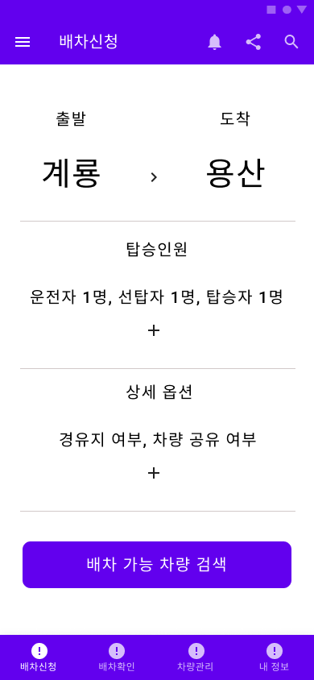
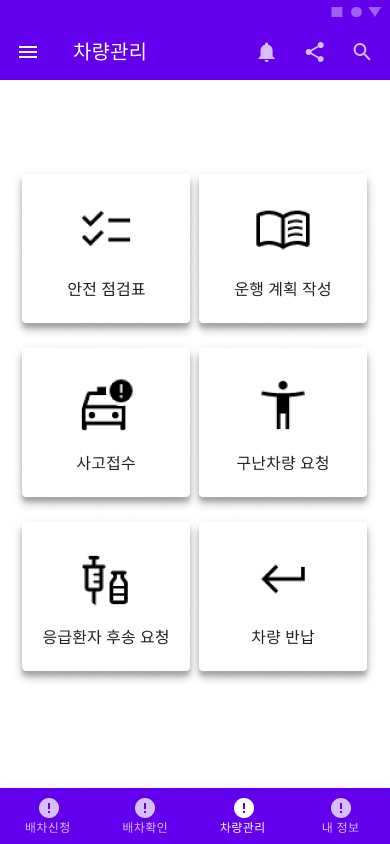

# Military Mobility Platform (군 모빌리티 플랫폼)
<br>
<div align="center">
    
</div>
<center><h3>군 모빌리티 플랫폼 : Military Mobility Platform</h3></center>

><center><h3>언제 어디서나 실시간으로 군 이동수단을 공유하는 플랫폼</h3></center>

# 목차
1. [프로젝트 소개](#프로젝트-소개)
2. [기능 설명](#기능-설명)
3. [App 구성 및 필수 조건 안내](#app-구성-및-필수-조건-안내)
4. [기술 스택](#기술-스택)
5. [설치 안내](#설치-안내)
6. [팀 정보](#팀-정보)
7. [저작권 및 사용권 정보](#저작권-및-사용권-정보)

## 프로젝트 소개
- 스마트폰 app을 통해 군 이동수단(차량)에 대한 정보를 실시간으로 공유하고 관리할 수 있는 플랫폼 제작

[(Back to top)](#목차)

## 기능 설명
 - [Figma 프로젝트 화면설계서 링크](https://www.figma.com/file/UTHVGHLnpkpmhcldx03Cjj/Military-Mobility-Platform?node-id=0%3A1)
 ### 1. 실시간 군 이동수단 배차 신청/승인
 
<table>
  <tr>
    <td align="center" width="50%"></td>
    <td>o 기능명: 실시간 배차신청<br><br>
     	o 개요: 군 이동수단(차량) 관련 실시간 배차신청 화면입니다. 출발지 목적지를 설정할 수 있으며, 탑승인원 그리고 경유지 등 세부사항을 설정할 수 있습니다. 군 이동수단의 효율적인 이용을 위해 세부 옵션을 같이 신청받아서 유동적으로 활용할 수 있습니다. 행선지가 같거나 시간을 분배해서 차량을 사용할 수 있다면 효율적으로 이용할 수 있습니다.<br><br>
	o 엑터명: 사용자(차량 탑승자)<br><br>
	o 사전 조건: 회원 가입이 되어있어야 함.<br>
	o 사후 조건: -<br><br>
	o 기능 흐름:<br>
	   1. 사용자는 출발지와 도착지를 설정합니다.<br>
	   2. 탑승인원 탭에서 운전자, 선탑자, 탑승자 인원수를 설정합니다.<br>
	   3. 상세 옵션에서 경유지 여부, 차량 공유 여부를 설정합니다.<br>
	   4. 배차 가능 차량 검색 버튼을 통해 실시간으로 예약/즉시 사용 가능한 차량을 검색합니다.</td>
  </tr>
</table>
<br>

 ### 2. 군 이동수단의 입체적인 관리
 
<table>
  <tr>
    <td align="center" width="50%"></td>
    <td>o 기능명: 군 이동수단의 입체적인 관리<br><br>
	o 개요: 군 이동수단의 관리 화면입니다. 안전 점검표를 차량 운행 전에 작성하고, 운행계획을 작성할 수 있습니다. 또한 사고접수, 구난차량 요청, 응급환자 후송 요청 등 응급상황에 대처할 수 있는 기능들을 포함하고 있습니다. 또한 차량 이용 완료 후에는 반납까지 one-stop으로 서비스를 받을 수 있습니다.<br><br>
	o 엑터명: 사용자(차량 탑승자)<br><br>
	o 사전 조건: 배차 신청 및 승인이 완료되어야 함.<br>
	o 사후 조건: -<br><br>
	o 기능 흐름:<br>
	   1. 사용자는 안전점검표 작성을 통해 차량의 안전 운행을 준비합니다.<br>
	   2. 운행 계획에 출발지, 도착지, 이동 경로, 특이사항 등을 기재합니다.<br>
	   3. 차량 사고 발생 시 사고접수, 구난차량 요청, 응급환자 후송 요청 등을 실시합니다.<br>
	   4. 차량 이용 완료 후 차량 반납 탭을 클릭해 차량 이용을 종료합니다.</td>
  </tr>
</table>
 
 - 운전병 마일리지 전산화
 
 - 사용자(탑승자)들의 군 이동수단 이용현황 분석(통계)
 
 - 사용자, 운행자, 수송업무담당자들의 커뮤니티 형성

[(Back to top)](#목차)

## App 구성 및 필수 조건 안내
* 크로스 플랫폼: iOS, Android 사용 가능
* 권장: 

[(Back to top)](#목차)

## 기술 스택
### 📲 Front-end

| Name     | Badge                                                                                                           | Version        | Website               |
| -------- | --------------------------------------------------------------------------------------------------------------- | -------------  | --------------------- |
| Dart     |           | undefined      | https://dart.dev/     |
| Flutter  |  | undefined      | https://flutter.dev/  |

### 🖥️ Back-end

| Name       | Badge                                                                                                          | Version    | Website                  |
| ---------- | -------------------------------------------------------------------------------------------------------------- | ---------- | ------------------------ |
| Python     |          | undefined  | https://www.python.org/  |
| DjangoREST |  | undefined | https://www.django-rest-framework.org/ |
 
### 💾 Databases

| Name     | Badge                                                                                                     | Version           | Website               |
| -------- | --------------------------------------------------------------------------------------------------------- | ----------------- | --------------------- |
| MariaDB  |   | undefined         | https://mariadb.org/  |

[(Back to top)](#목차)

## 설치 안내
```bash
$ git clone git주소
$ yarn or npm install
$ yarn start or npm run start
```

[(Back to top)](#목차)

## 팀 정보
<table width="800">
<thead>
<tr>
<th width="100" align="center">이름</th>
<th width="250" align="center">역할</th>
<th width="150" align="center">Github 계정</th>
<th width="300" align="center">E-mail</th>
</tr> 
</thead>

<tbody>
<tr>
<td width="100" align="center">박유진</td>
<td width="250" align="center">팀장(PM), UI/UX 디자인</td>
<td width="150" align="center">	
	<a href="https://github.com/LatteHorse" target="_blank"></a>
</td>
<td width="300" align="center">
	<a href="mailto:eugene5802@gmail.com">eugene5802@gmail.com</a>
</td>
</tr>
	
<tr>
<td width="100" align="center">박철완</td>
<td width="250" align="center">프론트엔드(Front-end) 개발</td>
<td width="150" align="center">	
	<a href="https://github.com/CodingVillain" target="_blank"></a>
</td>
<td width="300" align="center">
	<a href="mailto:cheolwan.park552@gmail.com">cheolwan.park552@gmail.com</a>
</td>
</tr>

<tr>
<td width="100" align="center">이승효</td>
<td width="250" align="center">프론트엔드(Front-end) 개발</td>
<td width="150" align="center">	
	<a href="https://github.com/AstroHyo" target="_blank"></a>
</td>
<td width="300" align="center">
	<a href="mailto:spinelee2002@gmail.com">spinelee2002@gmail.com</a>
</td>
</tr>
	
<tr>
<td width="100" align="center">박세환</td>
<td width="250" align="center">백엔드(Back-end) 개발</td>
<td width="150" align="center">	
	<a href="https://github.com/sehwan505" target="_blank"></a>
</td>
<td width="300" align="center">
	<a href="mailto:sehwan505@gmail.com">sehwan505@gmail.com</a>
</td>
</tr>

<tr>
<td width="100" align="center">박주환</td>
<td width="250" align="center">백엔드(Back-end) 개발</td>
<td width="150" align="center">	
	<a href="https://github.com/Jkworldchampion" target="_blank"></a>
</td>
<td width="300" align="center">
	<a href="mailto:standardjuhwan@gmail.com">standardjuhwan@gmail.com</a>
</td>
</tr>
</tbody>
</table>

[(Back to top)](#목차)

## 저작권 및 사용권 정보
 * [MIT](https://github.com/osamhack2022/APP_Military-Mobility-Platform_TeamName/blob/main/LICENSE)

This project is licensed under the terms of the MIT license.

※ [라이선스 비교표(클릭)](https://olis.or.kr/license/compareGuide.do)

※ [Github 내 라이선스 키워드(클릭)](https://docs.github.com/en/github/creating-cloning-and-archiving-repositories/creating-a-repository-on-github/licensing-a-repository)

※ [\[참조\] Github license의 종류와 나에게 맞는 라이선스 선택하기(클릭)](https://flyingsquirrel.medium.com/github-license%EC%9D%98-%EC%A2%85%EB%A5%98%EC%99%80-%EB%82%98%EC%97%90%EA%B2%8C-%EB%A7%9E%EB%8A%94-%EB%9D%BC%EC%9D%B4%EC%84%A0%EC%8A%A4-%EC%84%A0%ED%83%9D%ED%95%98%EA%B8%B0-ae29925e8ff4)

[(Back to top)](#목차)
